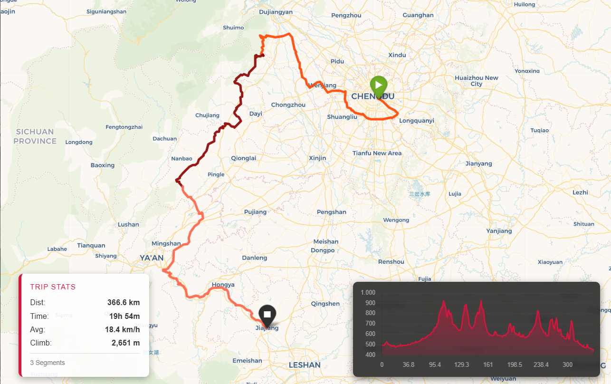

# FitMerge: GPX & FIT File Combiner

A tool to merge multiple Wahoo/Garmin `.fit` files into a single, seamless GPX track. It handles multi-day trips, visualizes data with an interactive map, and generates  elevation profiles.



## Features
* **Smart Merging:** Concatenates hundreds of `.fit` files chronologically.
* **Gap Handling:** Intelligently visualizes time jumps between rides (e.g., overnight stops).
* **Sensor Data:** Preserves Heart Rate, Cadence, and Temperature data in the GPX export.
* **Interactive Visualization:** Generates a standalone HTML map with:
    * Dark Mode / Satellite / CyclOSM layers.
    * Interactive Elevation Profile (Chart.js).
    * Trip Stats Dashboard (Distance, Moving Time, Elevation).

## Installation

### Prerequisites
* Python 3.8+

### 1. Clone & Setup
```bash
git clone [https://github.com/YOUR_USERNAME/fitmerge.git](https://github.com/YOUR_USERNAME/fitmerge.git)
cd fitmerge

# Create Virtual Environment (Recommended)
python -m venv venv

# Activate (Windows)
.\venv\Scripts\Activate

# Activate (Mac/Linux)
source venv/bin/activate

# Install Dependencies
pip install -r requirements.txt